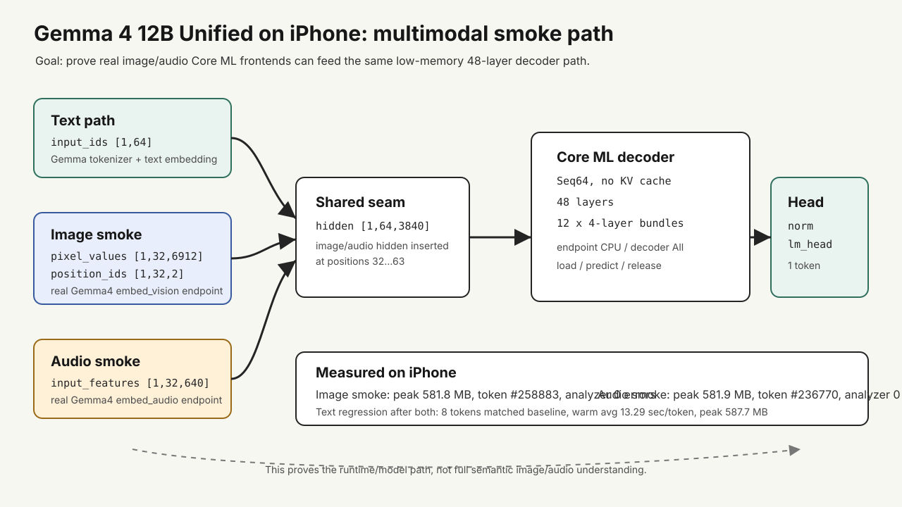

## はじめに

Gemma 4 12B Unified 系の「text / image / audio を扱える」という性質を、できるだけ保ったまま iPhone 実機へ載せる実験をしました。

結論からいうと、実用速度のチャットとしては厳しいです。一方で、**実際の Gemma 4 image/audio embedder を Core ML 化し、その出力を 48 層 decoder + norm/lm_head まで iPhone 実機で通す** ところまでは確認できました。

つまり「フル品質・フル速度」ではなく、**低メモリ iPhone でもマルチモーダル対応モデルの経路が一応動いた** という到達点の記録です。



## 実験環境

| 項目 | 内容 |
|---|---|
| Model | `google/gemma-4-12B-it-qat-q4_0-unquantized` |
| 実機 | iPhone 17（無印）, 256GB |
| device identifier | `iPhone18,3` |
| iOS | `26.4.2` |
| App | SwiftUI + Core ML |
| Core ML shape | fixed `Seq64` |
| Decoder | 48 layers, 4-layer chunks x 12 |
| KV cache | なし |
| Quantization | int4 per-block, block size 32 |
| Runtime setting | endpoint `CPU`, decoder `All` |
| Cache policy | run end |
| Retain decoders | 0 |

`iPhone18,3` は iOS のバージョンではなく、ログ上の Apple device identifier です。製品としては iPhone 17 の無印モデル、ストレージは 256GB の実機で確認しました。

変換は RunPod の A100 SXM 80GB で行い、ローカル Mac で `.mlpackage` を `.mlmodelc` に compile して iOS app に同梱しました。

## まず分かったこと

12B を iPhone にそのまま載せる場合、速度の主なボトルネックは推論演算そのものよりも、分割した Core ML bundle の load / release でした。

安定構成では 8 token 生成が以下のような状態になりました。

| 項目 | 結果 |
|---|---:|
| tokens | 8 |
| warm avg | 13.29 sec/token |
| peak memory | 587.7 MB |
| generated IDs | `#85141,#236924,#52119,#12553,#237221,#66447,#237669,#237230` |

decoder の予測自体は比較的短く、毎 token の大半は 12 個の decoder chunk を読む時間に使われています。

## 構成

既存の text path はこうなっています。

```text
input_ids
  -> text embedding Core ML
  -> hidden [1,64,3840]
  -> 48 decoder layers
  -> norm + lm_head
  -> logits
```

今回の multimodal smoke は、この `hidden [1,64,3840]` の seam に image/audio embedder の出力を差し込む形にしました。

```text
pixel_values + image_position_ids
  -> Gemma4 embed_vision Core ML
  -> image_hidden [1,32,3840]
  -> hidden [1,64,3840] の後半へ挿入
  -> 48 decoder layers
  -> norm + lm_head
```

```text
input_features
  -> Gemma4 embed_audio Core ML
  -> audio_hidden [1,32,3840]
  -> hidden [1,64,3840] の後半へ挿入
  -> 48 decoder layers
  -> norm + lm_head
```

## Image smoke

変換した image embedder の Core ML contract は以下です。

| input/output | shape |
|---|---|
| `pixel_values` | `fp32 [1,32,6912]` |
| `image_position_ids` | `int32 [1,32,2]` |
| `image_hidden` | `fp16 [1,32,3840]` |

実機結果:

| 項目 | 結果 |
|---|---:|
| image embedder load | 0.2879 sec |
| image embedder predict | 0.0161 sec |
| peak memory | 581.8 MB |
| generated token | `#258883` |
| token total | 34.4571 sec |
| analyzer | 0 errors / 0 warnings |

この時点で、実際の Gemma 4 image embedder Core ML endpoint の出力を decoder に渡し、norm/lm_head まで完走できました。

## Audio smoke

audio embedder はさらに小さいです。

| input/output | shape |
|---|---|
| `input_features` | `fp32 [1,32,640]` |
| `audio_hidden` | `fp16 [1,32,3840]` |

実機結果:

| 項目 | 結果 |
|---|---:|
| audio embedder load | 0.0389 sec |
| audio embedder predict | 0.0027 sec |
| peak memory | 581.9 MB |
| generated token | `#236770` |
| token total | 33.1126 sec |
| analyzer | 0 errors / 0 warnings |

audio 側も同じ decoder / norm+lm_head 経路を通せました。

## なぜここを「限界点」と見ているか

一番大きい制約は、標準の image processor が現行の Seq64 に収まらないことでした。

RunPod 上で確認したところ、`<|image|>` を使う通常の processor 経路では、小さい PIL image を渡しても 256 image tokens になり、`pixel_values` は `[1,280,6912]` になりました。今回の iPhone app は fixed Seq64 なので、そのままでは入りません。

また、48 層を減らすと速度は改善しうるものの、Gemma 4 12B としての意味が薄くなります。decoder chunk を 8-layer に広げる実験もしましたが、iPhone 側の execution-plan compilation で失敗するため不採用にしました。

結果として、今回の実験は次のように整理できます。

- 12B を低メモリ iPhone で実用チャットにするのは厳しい
- 速度の主因は decoder bundle の load/release
- 48 層 + 4-layer chunk + Seq64 が現時点の安定ライン
- image/audio の実 embedder を通す feasibility smoke は成立
- full image/audio prompting には Seq/token budget の再設計が必要

## llama.cpp / GGUF ならどうだったか

この実験後に整理し直すと、Gemma 4 12B を iPhone で動かす別ルートとして `llama.cpp` + GGUF は十分に検討価値があります。

Google は Gemma 4 の llama.cpp 実行手順を公開しており、Gemma 4 12B の QAT GGUF も用意されています。公式のメモリ目安では Gemma 4 12B の Q4_0 は約 6.7GB で、Mac や RAM に余裕のある端末なら Core ML 分割版より高速に動く可能性が高いです。

ただし、今回の目的は「低メモリ iPhone でも 12B multimodal 経路を一応通す」ことでした。この観点では、GGUF は必ずしも楽ではありません。

| 方式 | 強い点 | 今回の目的での弱点 |
|---|---|---|
| Core ML 4-layer chunk | peak memory を 600MB 前後まで抑えられた | 毎 token で bundle load/release が重く、約13 sec/token |
| llama.cpp + GGUF | 実行系が成熟しており、mmap や Metal 最適化を使える | 12B Q4 本体に加えて KV/cache/runtime が必要で、低メモリ端末では常駐メモリが厳しい |
| GGUF shard / split | 配布やファイル管理には便利 | Core ML のような layer chunk load/release にはならない |

また、Gemma 4 12B は encoder-free Unified 構成なので、image/audio の扱いも単純な text-only GGUF より難しいです。`llama.cpp` 側の multimodal 対応は進んでいますが、記事執筆時点では Gemma 4 12B vision の挙動に関する issue もあり、E2B/E4B よりは安定度の見極めが必要でした。

つまり、速度を狙うなら `llama.cpp` + GGUF を先に試す価値はありました。一方で、今回のように「少ない常駐メモリで、実際の image/audio embedder 出力を decoder まで通す」ことを優先するなら、Core ML 分割にも意味がありました。

## MoE なら違ったか

MoE も方向性としてはかなり有望だと考えています。たとえば on-device 向け MoE では、総 5B から 8B 程度、active 1B 前後のモデルがスマートフォンで現実的な速度を出す例が出ています。

公開事例ベースで見ると、だいたい次のような感覚になります。

| 例 | 総params / active params | スマートフォン観点 |
|---|---:|---|
| MobileMoE-L | 5.3B / 0.9B | iPhone 16 Pro などでオンデバイス profiling された研究例 |
| LFM2-8B-A1B | 8.3B / 1.5B | 高級スマホ/タブレット/ノートPC向けを明示した on-device MoE |
| Flash-MoE 系デモ | 約397B / 17B | iPhone 17 Pro で動く技術デモはあるが、約0.6 tok/s級で実用速度ではない |

ただし、これは「最初から MoE として訓練され、ランタイムも inactive experts を読まない」場合の話です。dense な Gemma 4 12B を後から機械的に MoE 化して速くするのは、実質的には別モデルの研究開発になります。

今回の 12B Core ML 実験から得た教訓は、次のようにまとめられます。

- dense 12B を iPhone に載せる場合、低メモリ化と速度は強くトレードオフする
- 速度を本気で狙うなら、モデル側も on-device 前提の設計が必要
- 実用 UX まで考えるなら、Gemma 4 12B にこだわるより、小さめの multimodal model や native mobile MoE が現実的

## やってよかったこと

今回の実験で一番効いたのは、いきなり full multimodal prompt を目指さず、decoder 入力 seam を固定して段階的に確認したことでした。

1. text-only 48-layer decoder を安定させる
2. norm+lm_head endpoint を正しくする
3. synthetic hidden を decoder に流す
4. real image embedder を流す
5. real audio embedder を流す
6. 最後に text regression で既存経路が壊れていないことを確認する

この順番にしたことで、どこで壊れたかを見失わずに済みました。

## 最終的な感想

「Gemma 4 12B Unified を iPhone で普通に使う」という意味では、かなり厳しいです。

ただ、「マルチモーダル対応モデルの一部を小さく切り出し、低メモリ端末上で実際の Core ML 経路として成立させる」という意味では、十分に面白い結果になりました。

特に image/audio embedder は decoder 本体に比べるとかなり軽く、実機上でも load/predict は小さいです。問題はその先の 48-layer decoder をどう扱うかであり、ここが 12B on-device の本丸でした。

次にやるなら、12B の速度改善をさらに追うより、以下のどちらかが現実的だと思っています。

- real image/audio preprocessing を小さい smoke input へつなぐ
- もっと小さい multimodal model で実用 UX を狙う

今回の到達点は、後者へ進む前の「12B ではどこまで粘れるか」のよい境界線になりました。

## 参考

- [Gemma 4 model overview](https://ai.google.dev/gemma/docs/core)
- [Gemma 4 model card](https://ai.google.dev/gemma/docs/core/model_card_4)
- [Run Gemma with llama.cpp](https://ai.google.dev/gemma/docs/integrations/llamacpp)
- [google/gemma-4-12B-it-qat-q4_0-gguf](https://huggingface.co/google/gemma-4-12B-it-qat-q4_0-gguf)
- [llama.cpp multimodal docs](https://github.com/ggml-org/llama.cpp/blob/master/docs/multimodal.md)
- [Gemma 4 12B vision issue in llama.cpp](https://github.com/ggml-org/llama.cpp/issues/24146)
- [MobileMoE: Scaling On-Device Mixture of Experts](https://arxiv.org/abs/2605.27358)
- [LFM2-8B-A1B: An Efficient On-device Mixture-of-Experts](https://www.liquid.ai/blog/lfm2-8b-a1b-an-efficient-on-device-mixture-of-experts)
- [Anemll/Flash-iOS](https://github.com/Anemll/Flash-iOS)
