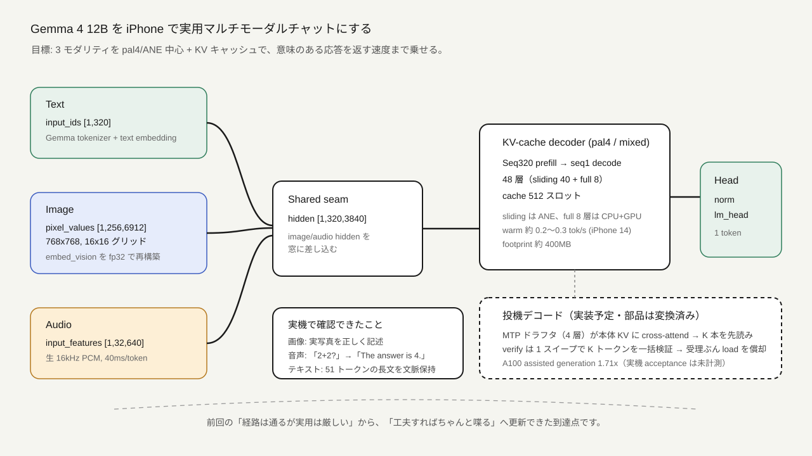
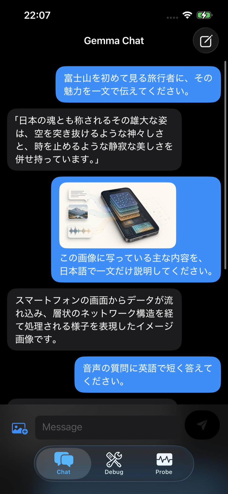
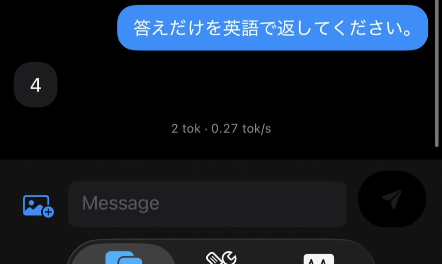

:::message
本記事は AI（Claude / Codex）の補助を受けて執筆しています。実装・実機計測・数値はすべて実際に行ったものですが、文章の構成や整理、説明画像の作成に AI を利用しています。
:::

## はじめに

前回、[Gemma 4 12B Unified を Core ML 化して低メモリ iPhone でマルチモーダル経路だけ通す](https://zenn.dev/lube8163/articles/89d24e671d1eaa) という記事を書きました。あのときの到達点は、次のようなものでした。

- 実際の Gemma 4 image/audio embedder を Core ML 化し、48 層 decoder + norm/lm_head まで iPhone 実機で通せた
- ただし **実用速度のチャットとしては厳しい**（int4/CPU で約 12 秒/トークン）
- 画像・音声は 32 トークンの smoke で、意味理解までは踏み込めていない

そして「12B ではどこまで粘れるか、のよい境界線になった」と締めていました。

今回はその境界線を越えた話です。結論から言うと、iPhone 14（A15、6GB）の 1 台で、次のところまで到達しました。

- **テキスト / 画像 / 音声のマルチモーダルチャットが、意味のある応答を返すレベルで動く**
- 実写真を「透明度の高い青い水と、点在する大きな岩が特徴的な美しい湖」と正しく記述する
- 話しかけた「What is two plus two?」を理解し、「4」と答える
- KV キャッシュで長い応答（最大 192 トークン）を、文脈を保ったまま生成できる

速度も、int4/CPU の約 12 秒/トークンから、pal4/ANE 中心の混合実行で iPhone 14 では約 4 秒/トークン（約 0.2〜0.3 tok/s、より新しい A19 機なら約 2 秒）まで改善しました。さらにその先、**投機デコードで約 2 倍化**する道筋も見えています。

この記事は、そこに至るまでに踏んだブレイクスルーとバグの記録です。数値はすべて iPhone 実機・完全オフラインで計測したものです。

_Gemma 4 12B のテキスト・画像・音声を、1台の iPhone 内で処理する構成のイメージです。_

## 実験環境

| 項目 | 内容 |
|---|---|
| Model | `google/gemma-4-12B-it-qat-q4_0-unquantized` |
| 実機 | iPhone 14（A15 Bionic, 6GB RAM） |
| iOS | 26.5 |
| App | SwiftUI + Core ML |
| 量子化 | pal4（4bit palettization, per-grouped-channel group16） |
| 実行 | sliding attention 40 層は ANE、full attention 8 層の decode は CPU+GPU |
| 変換 | RunPod（A100 80GB）で Core ML 化し、Mac で `.mlmodelc` に compile |

前回は iPhone 17 でしたが、途中から **A15・6GB の iPhone 14 に開発機を移しました**。「一番厳しい条件でも動くか」を確かめたかったのと、ANE 上の重みは 6GB 機でも jetsam 予算を圧迫しにくい性質があるためです。

_3 種類の入力を共通の hidden 表現に揃え、Seq320 prefill と KV cache decode に流す構成です。実線は現在動作している経路、破線は次に実装する投機デコードを示します。_

## 突破口 1：int4 は CPU 縛り、pal4 なら ANE で走る

前回の 12 秒/トークンは int4（`constexpr_blockwise_shift_scale` による per-block 量子化）でした。ここに決定的な制約がありました。

**int4-block で量子化した Core ML モデルは、compute units の指定に関係なく、常に BNNS（CPU）で実行されます。** ANE も GPU も `constexpr_blockwise_shift_scale` を受け付けないためです。さらに BNNS には同時実行プラン数 ≈ 6 という硬い上限があり、7 個目で `error -14` を返します。decoder を常駐させられなかった真因は、メモリではなくこれでした。

そこで **pal4（kmeans 4bit LUT palettization, per-grouped-channel group16）に変換し直しました**。すると同じ 4bit でも ANE で実行できます。

| 量子化 | 実行先 | predict（4 層 chunk @ seq64） | アプリ footprint |
|---|---|---|---:|
| int4-block | BNNS（CPU） | 0.111s | 常駐不可 |
| pal4_g16 | ANE | 0.023s（**4.5 倍速**） | 約 33MB（ANE 側マップ） |

ANE で実行すると演算が 4.5 倍速くなり、しかも重みは ANE 側にマップされるので、アプリの footprint をほとんど食いません。これがすべての土台になりました。

ただし、ANE 特有の壁もありました。Gemma 4 の decoder は sliding attention ×5 + full attention ×1 の周期で並びますが、**full attention 層を含む 4 層 chunk は、初回の ANE コンパイルで一時メモリが跳ねて SIGKILL されます**。これは「full attention 層を 1 層単独に分割すれば ANECCompile が通る」ことが分かり、`sliding-only 4 層 chunk × 4 + 単層 × 32 = 36 モデル` という構成に落ち着きました。

## 突破口 2：KV キャッシュで「読める長さ」を出す

pal4/ANE 化で 1 トークンあたりは速くなりましたが、当初は固定 Seq64 窓に生成トークンを右詰めしていく方式だったため、長い応答では窓が溢れて文脈が壊れていました。

そこで **KV キャッシュを実装しました**。各層について、次の 2 つの固定シェイプ Core ML グラフを、同じ pal4 重みを共有して用意します。

- **prefill グラフ**：320 トークン窓を一括処理して KV キャッシュを埋め、最初のトークンを出す
- **decode グラフ**：以降は seq=1 の入力を `[キャッシュ ; 新トークン]` に対してアテンションさせる

層ごとに KV の形状が違う（sliding 層は GQA で 8×256、full attention 層は K=V 共有の MQA で 1×512）点だけ注意が必要です。

結果、iPhone 14 では、数トークンで崩れずに完結した文章を返せるようになりました。記事用の実機画面は、次の入力で改めて計測したものです。

> **入力**：富士山を初めて見る旅行者に、その魅力を一文で伝えてください。
>
> **実機出力**：「日本の魂とも称されるその雄大な姿は、空を突き抜けるような神々しさと、時を止めるような静寂な美しさを併せ持っています。」

応答は 41 トークンで、文末まで生成した後に turn delimiter で停止しました。スクリーンショットでは、入力文、応答全文、生成トークン数と tok/s 表示を確認できます。
実機画面は、続けて実行した画像チャットと同じ1枚のスクリーンショットにまとめて、次のセクションに掲載します。

固定窓では数トークンで崩れていたものが、KV キャッシュでは 512 スロット（最大 192 生成トークン）まで文脈を保てます。速度は warm で **約 4.3 秒/トークン**、ピークメモリは約 400MB です。

### ハマりどころ：KV の position は「絶対」ではなく「相対」

最初、decode の RoPE position に絶対キャッシュスロット番号（320, 321, …）を渡していたところ、2 トークン目以降が崩壊しました。prefill 側は左パディングを除いた実トークンを 0, 1, 2, … と採番しているのに、decode がずれた位置を渡していたためです。`written - leftPad` に直したところ、キャッシュ無し経路と完全に一致するようになりました。

### ハマりどころ：full attention 層の decode は ANE を拒否する

full attention 層（MQA 1×512、513 キーの concat）の decode グラフは、ANE の実行プラン構築が **intermittent に失敗**します（CoreML error -5、コンパイル時に約 1.4GB のメモリスパイク）。生成が途中でクラッシュしていた原因がこれでした。この 8 層だけ ANE → CPU+GPU に逃がしたところ、安定しました。sliding 40 層は ANE のままです。

## 画像チャット：32 トークンでは分布外、256 トークンで意味が出る

前回の画像 smoke は 32 パッチでした。これを実際のチャットに使うと、色を聞いても `<pad><eos>` を返すばかりで、まったく意味を成しませんでした。

原因を実機ログで追うと、**全ロジットが softcap 値 29.969 に張り付いて飽和**していました。さらに掘ると、画像 embedder の Core ML が **入力に関係なく全ゼロ（一部 NaN）を出力**していたのです。

これは fp16 変換の数値バグでした。vision embedder の内部 RMSNorm が分散計算で `x²` を fp16 で計算しており、pos_norm 出力（maxAbs ≈ 750）の二乗が fp16 の上限 65504 を超えて `inf` になり、`rsqrt(inf)=0` で正規化係数がゼロになって、出力が全部ゼロになっていました。**vision embedder を fp32 演算で作り直したところ直りました**（音声 embedder は入力が小さくオーバーフローしないため、無事でした）。

ここまでで色は判別できるようになりましたが、まだ 32 パッチでは粗いままです。Gemma 4 の画像処理は本来 **256 トークン**（16×16 グリッド、768×768 画素）が学習分布なので、そこに合わせました。

- 256 パッチの image embedder を fp32 で再構築
- decoder / embedding を **Seq320** に再変換（256 画像トークン + プロンプト + テンプレート）
- 画像ソフトトークンのブロック内は双方向アテンション（HF 実装に準拠）

すると、実写真をきちんと記述できるようになりました。

> **質問**：この写真を詳しく説明してください。（タホ湖の風景写真）
>
> **応答**：この写真は、非常に透明度の高い青い水と、点在する大きな岩が特徴的な、非常に美しい湖（または海）の風景を捉えています。…

湖・岩・雪山といった要素を、実際に写っているとおりに拾えています。

タホ湖の実写真に加えて、記事冒頭に掲載したオンデバイス AI の説明画像も、同じ実機アプリへ入力しました。スクリーンショットに使うのはこちらの実行結果です。

> **入力画像**：本記事の冒頭に掲載した、テキスト・写真・音声がスマートフォン内のネットワーク層へ流れ込むイメージ
>
> **プロンプト**：この画像に写っている主な内容を、日本語で一文だけ説明してください。
>
> **実機出力**：スマートフォンの画面からデータが流れ込み、層状のネットワーク構造を経て処理される様子を表現したイメージ画像です。

この回答は 29 トークンで完結しました。写真の風景だけでなく、抽象的な説明図についても、「データの流れ」と「層状のネットワーク」という主要な意味を拾えています。

_iPhone 14 実機のチャット画面。富士山についてのテキスト入力に続けて説明画像を添付し、データの流れと層状ネットワークを読み取った応答です。_

### ハマりどころ：`<eoi>` トークンの埋め込みが fp16 をオーバーフローさせる

画像ブロックを本来の `<eoi>`（258882）で閉じると、また全ロジットが softcap に張り付きました。調べると、**`<eoi>` の埋め込み行が通常の 5.7 倍の RMS を持っており**、fp16 の decoder をオーバーフローさせていました。ブロックを改行トークンで閉じることで回避しています（`<eoa>` も同じリスクがあり、同様に回避しました）。

## 音声チャット：こちらは素直に通った

音声は拍子抜けするほど素直でした。Gemma 4 Unified の音声入力は mel スペクトログラムではなく、**生の 16kHz PCM を 640 サンプル（40ms）ごとに切るだけ**で、入力値が小さいので fp16 embedder でもオーバーフローしません。しかも 32 音声トークン = 1.28 秒は、フレーム数＝トークン数の可変長構造で、画像の固定 256 と違って**分布のズレがありません**。

Mac の `say` コマンドで作った音声を、16kHz・mono・16bit PCM の WAV に変換して実機へ送りました。今回使った音声は 1.175 秒で、次の内容を話しています。

> **音声で話した内容**：`What is two plus two?`
>
> **画面上のプロンプト**：答えだけを英語で返してください。
>
> **実機出力**：`4`

実機出力は 2 トークン（`4` + turn delimiter）で、推論は約 7.5 秒で完了しました。オンデバイスで、音声の読み取り、質問内容の理解、回答まで完結しています。

チャット画面には添付した音声の波形や文字起こしが表示されないため、スクリーンショットのキャプションにも、実際に話した `What is two plus two?` を明記します。

_1.175 秒の音声「What is two plus two?」を 16kHz・mono・16bit PCM で入力し、iPhone 14 実機上で `4` と回答した画面です。撮影時の表示は 2 tok・0.27 tok/s でした。_

なお、440Hz のトーンや無音は、それぞれ違う（それらしい）応答を返し、入力内容を区別できていました。

## 速度の本丸：投機デコードへ

ここまでで実用チャットにはなりましたが、warm でも 4.3 秒/トークンはまだ遅い数字です。そこで decode 1 トークンの内訳を、実機ログで分解してみました。

| 項目 | 時間 | 割合 |
|---|---:|---:|
| decode モデルの load ×48（毎トークン 5.3GB 転送） | 3.5–3.8s | **82%** |
| 48 層の predict（ANE 演算） | 0.6s | 14% |
| embedding + lm_head | 0.02s | ~0% |

**演算はたった 0.6 秒で、ボトルネックは「毎トークン 48 モデルを再ロードすること」でした。** しかも load はバイト数にほぼ比例するので、チャンクの分割粒度を変えても総和は変わりません。常駐（retain）も試しましたが、A15 の ANE は 24 モデル以上の常駐で contention が悪化し、48 常駐は OOM でした。

この構造は、投機デコードと相性がとても良いのです。検証（verify）は K トークンをまとめて 1 回の 48 層スイープで処理できるので、「1 スイープ ≈ 4 秒」を受理トークン数ぶんに償却できます。

そして幸運なことに、**Gemma 4 は公式の MTP（Multi-Token Prediction）ドラフタを配布しています**（`google/gemma-4-12B-it-assistant`）。4 層・hidden 1024 の小型モデルで、自前の k/v proj を持たず、**本体の KV キャッシュにクロスアテンションする**設計です。これは我々の実装がすでに持っている情報（本体の最終層 hidden、KV キャッシュ、トークン埋め込み）だけで駆動できます。

A100 で HF の assisted generation を測ると、greedy で GPU speedup 1.71 倍、出力はほぼ本体と一致しました。GPU は演算律速なのでこれは下限で、**モバイルは load 律速なので、受理トークンぶんそのまま効く**と見込んでいます（推定 4.3 → 約 2.2 秒/トークン、約 2 倍）。ここはまだ実機での受理率を測る前の見積もりです。

ドラフタの Core ML 変換も済ませました。draft ステップ（seq=1）の固定シェイプグラフに落とし、**fp16 版は HF の forward と argmax が完全に一致**しました。cross-attention という特殊構造も、seq=1 ではマスクが単純なパッドマスクに帰着すること（HF 実装のコメントにも「q_len==1 は full attention」とあります）を使って、変換できないマスク構築処理を回避できました。

投機デコードの本実装（verify グラフ、Swift の draft→verify→受理ループ）はこれからですが、部品はすべて揃っています。

## 現在地

前回「実用速度は厳しい」で終わった 12B が、いまは iPhone 14 の 1 台で、次のところまで来ました。

- text / image / audio の 3 モダリティが、意味のある応答を返す
- KV キャッシュで長文・文脈保持ができる
- sliding attention 40 層は ANE、full attention 8 層の decode は CPU+GPU で安定動作する
- アプリの footprint は約 400MB で、6GB 機で長文生成できる

速度も int4/CPU の 12 秒/トークンから pal4/ANE 中心の混合実行で約 4 秒/トークン（約 0.2〜0.3 tok/s、A19 機なら約 2 秒）まで来ており、投機デコードで更に半分が見えています。

「12B は iPhone では飾り」ではなく、「工夫すればちゃんと喋る」に更新できたのが、今回の収穫です。

## 踏んだバグの索引

デバッグの記録として、今回効いたポイントを並べておきます。同じ轍を踏む方の役に立てば幸いです。

- int4-block は ANE で動かない（BNNS 縛り、同時 6 プラン上限）→ pal4/ANE へ
- full attention 4 層 chunk は初回 ANE コンパイルで SIGKILL → 単層分割へ
- vision embedder が fp16 RMSNorm のオーバーフローで全ゼロ出力 → fp32 演算で再構築
- `<eoi>` / `<eoa>` の埋め込みが高 RMS で fp16 decoder をオーバーフロー → 改行で代替
- KV decode の RoPE position は絶対スロットでなく相対（`written - leftPad`）
- full attention 層の KV decode は ANE の実行プラン構築を intermittent に拒否 → その 8 層だけ CPU+GPU へ

## 参考

- 実装・変換スクリプト：[llm-smallification（GitHub）](https://github.com/lube8163-lab/llm-smallification)
- 変換済み Core ML モデル：[gemma-4-12b-coreml-iphone-practical-chat（Hugging Face）](https://huggingface.co/lube8163/gemma-4-12b-coreml-iphone-practical-chat)
- 前回記事：[Gemma 4 12B Unified を Core ML 化して低メモリ iPhone でマルチモーダル経路だけ通す](https://zenn.dev/lube8163/articles/89d24e671d1eaa)
- [Gemma 4 Multi-Token Prediction (MTP) — Google AI for Developers](https://ai.google.dev/gemma/docs/mtp/overview)
- [google/gemma-4-12B-it-assistant（MTP ドラフタ）](https://huggingface.co/google/gemma-4-12B-it-assistant)

:::message
その後、MTP投機デコード、iPhone世代別の実行先、6層融合モデルまで実装・実機検証しました。
続編の原稿は
[`gemma4-12b-coreml-iphone-speculative-decoding.md`](./gemma4-12b-coreml-iphone-speculative-decoding.md)
にまとめています。
:::
